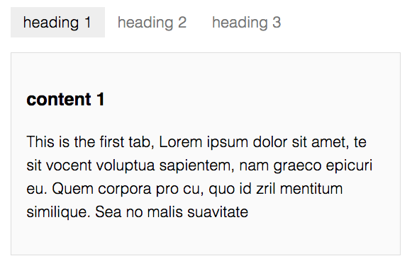

# react-tab-view

react-tab-view is a simple tabs component using react.js.



## Installation

`npm install react-tab-view --save`

## Usage

```javascript
var React = require('react');
var tabs = require('react-tab-view'),
    Tabs = tabs.Tabs,
    Tab = tabs.Tab,
    headers = ['heading 1', 'heading 2', 'heading 3'];

var TabExample = React.createClass({
  render: function() {
    return (
    	<Tabs headers={headers}>
    		<Tab>
    			<h3>content 1</h3>
    			<p>This is the first tab</p>
    		</Tab>
    		<Tab>
    			<h3>content 2</h3>
    			<p>This is the second tab</p>
    		</Tab>
    		<Tab>
    			<h3>content 3</h3>
    			<p>This is the third tab</p>
    		</Tab>
    	</Tabs>
    );
  }
});

React.render(
  <TabExample />,
  document.getElementById('container')
);

```

## Styles

react-tab-view can be used with your own custom styles. A minimal tabs.css style sheet is included as a guide.

## Development

Initial set up, run:
    
    npm install

## License

[MIT](http://isekivacenz.mit-license.org/)
